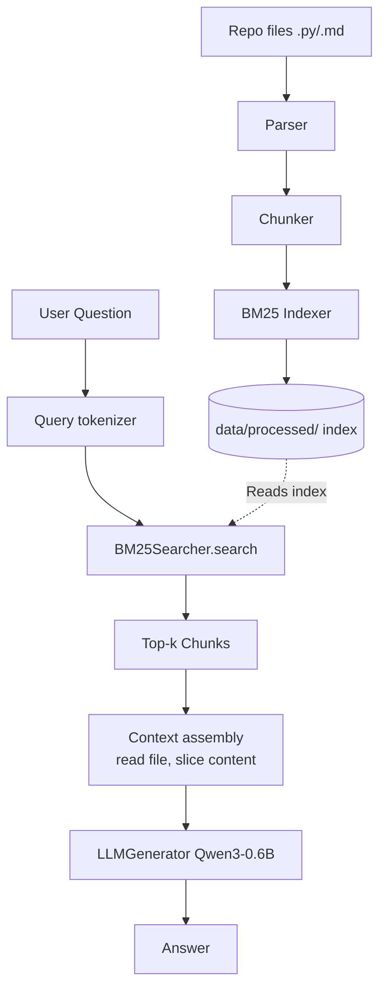

*This project has been created as part of the 42 curriculum by vkotera.*

# RAG Against the Machine

## Description

This project implements a **Retrieaval-Augmented Generation(RAG)** system. Instead of letting the Ai guess from memory, the system first finds the rigght documetns and forcess the model to answer strictly based on those facts.

**Goal:** build a working RAG pipeline from scratch (or using selected libraries) that can:
1. Ingest and chunk a set of source documents.
2. Index those chunks so they can be retrieved efficiently based on semantic similarity.
3. Given user question, retrieve the most erelevant chunks and feed them, along with the question, to a language model to produce answer

**Overview:**
The system works in two main phases: first, it prepares and saves the documents into a database (Indexing), and second, it searches this database to generate an answer whenever a question is asked (Querying).

## Instructions

### Installation
```bash
make install # runs `uv sync`, installs all dependencies from pyproject.toml
```

### Indexing the repository

```bash
uv run python -m src index --max_chunk_size <int>
```

This parses every `.py` and `.md` file under `data/raw/vllm-0.10.1`, chunks it, builds
a BM25 index, and saves it to `data/processed/` (`chunks.pkl` + BM25 index files).

### Running / querying

```bash
uv run python -m src search <query> -–k <int>
uv run python -m src answer "how does the scheduler work?" --k 1
```
Return the top-k sources for a single query.

### Batch answering & evaluation
```bash
# Run retrieval for a whole dataset of questions
uv run python search_dataset -–dataset_path <path> -–k <int> -–save_directory <dir>

# Run retrieval + answer generation for a whole dataset
uv run python -m src answer_dataset –student_search_results_path <path> –save_directory <dir>

# Compute Recall@k against ground truth
uv run python -m src evaluate –student_search_results_path <path> –dataset_path <path>
```

### Linting
```bash
make lint    # flake8 + mypy
```

## System architecture
The pipeline is composed of the following components:
1. **Parser** (`src/parser.py`) — walks the target repository (`data/raw/vllm-0.10.1`)
   and loads every `.py` and `.md` file's raw text content.

2. **Chunker** (`src/chunker.py`) — splits each file's content into bounded, addressable
   chunks (`file_path`, `first_character_index`, `last_character_index`), respecting
   Python/Markdown structure (see [Chunking strategy](#chunking-strategy)).

3. **Indexer** (`src/index.py`) — tokenizes all chunks and
   builds a **BM25** sparse index (via [`bm25s`](https://github.com/xhluca/bm25s)),
   persisted to `data/processed/` together with the raw chunk metadata (`chunks.pkl`).

4. **Retriever** (`BM25Searcher` in `src/index.py`) — loads the BM25 index and, given a
   query, tokenizes it the same way and retrieves the top-k matching chunks.

5. **Generator / LLM** (`src/llm.py`) — loads `Qwen/Qwen3-0.6B` via `transformers`,
   builds a chat prompt from the retrieved context + question, and generates a short
   answer.

6. **Evaluator** — compares retrieved source spans against a
   labeled ground-truth dataset and reports **Recall@k**.

**Data flow:**



## Chunking strategy

* **Markdown (`.md`):** Split by natural paragraphs (blank lines) and packed up to the `max_chunk_size` limit to avoid cutting sentences in half.
* **Python (`.py`):** Parsed via AST to keep classes and functions intact. Huge classes are smartly broken down into methods; surrounding text is preserved. 
* **Metadata:** Regex extracts enclosing `class`/`def` names and injects them directly into the chunk's text to boost retrieval hits.

**Why this approach?**
Instead of blind character-count splits, structure-aware chunking preserves the actual context. This ensures:
1. **Better Retrieval:** The BM25 algorithm doesn't miss keywords that would otherwise be split across chunks.
2. **Better Generation:** The LLM receives coherent logic (whole functions or paragraphs) instead of fragmented code, which drastically reduces hallucinations.

## Retrieval Method

We implemented a **Hybrid Search Pipeline** that combines sparse lexical retrieval with dense semantic embeddings to maximize accuracy. 

* **Lexical Branch (BM25):** We use `bm25s` for exact term matching. Code identifiers in `camelCase` or `snake_case` are split into separate words (e.g., `FusedMoE` → `Fused Mo E`). A chunk's index includes its raw `content`, extracted `class_name`, and its `file_path` (repeated 3× to boost hits on exact file names).
* **Semantic Branch (ChromaDB):** In parallel, every chunk is vectorized using the lightweight CPU-based `all-MiniLM-L6-v2` model and stored locally in ChromaDB. This allows the system to understand the natural language intent behind a query, even if the exact keywords are missing.
* **Reciprocal Rank Fusion (RRF):** Queries are processed by both branches. Since BM25 and vector similarity use entirely different scoring scales, we merge their Top-K results using the RRF algorithm. This mathematically rewards chunks that rank highly in both systems.
* **Context Assembly:** The final Top-K chunks are grouped by source file, and their exact character ranges are sliced directly from the disk to construct a clean, coherent context prompt for the LLM.

## Performance analysis

Retrieval quality is measured with **Recall@k**, for
`k ∈ {1, 3, 5, 10}`, against the labeled datasets in
`data/datasets/AnsweredQuestions/`

**Matching rule:** a ground-truth source is counted as a "hit" if any retrieved
  source from the same `file_path` overlaps it with an **Intersection-over-Union
  (IoU) ≥ 0.05** over their character ranges — i.e. exact chunk boundaries don't need
  to match, only sufficient overlap with the true answer span.
- **Per-question recall:** `hits / len(ground_truth_sources)`, averaged over all
  questions that have at least one labeled source.

## Design Decisions

* **Hybrid Retrieval over Pure BM25:** Lexical search (BM25) excels at exact keyword and file path matching, but fails on synonyms or conceptual questions. Adding a dense vector index (ChromaDB) bridges this gap, providing the best of both worlds.
* **Lightweight Sentence Transformer:** We specifically chose `all-MiniLM-L6-v2` because it runs extremely fast purely on the CPU, maintaining the project's requirement for local execution without relying on expensive GPU clusters.
* **Reciprocal Rank Fusion (RRF):** We used RRF instead of arbitrary weight balancing (like 70% BM25 / 30% Vector) because it relies purely on the mathematical rank of the documents, making the fusion robust and immune to score-scale mismatches.
* **Identifier Splitting:** Expanding `camelCase` and `snake_case` allows natural language queries to easily match complex code variables in the BM25 branch.
* **AST-based Chunking:** Splitting `.py` files by syntax (functions/classes) rather than fixed character limits ensures the LLM receives coherent, unbroken logic as context.
* **Small Local LLM (Qwen3-0.6B):** Ensures the entire pipeline runs completely locally without external APIs, trading top-tier generation quality for speed and independence.
* **IoU-based Recall:** Since algorithmic chunks rarely match hand-labeled ground truth perfectly, evaluation relies on a flexible ≥ 5% character overlap rather than exact string equality.

## Challenges Faced

* **LLM Hallucinations (Qwen3-0.6B):** Generating accurate and reliable answers was one of the biggest hurdles. Because Qwen3-0.6B is an extremely lightweight local model, it is highly sensitive to the quality of its input. If the BM25 chunks provided as context were too short or fragmented, the model would easily lose track and start hallucinating code or inventing fake API endpoints. It required heavy tuning of the AST chunker to ensure the LLM received complete, logical blocks of code to properly ground its answers.
* **The "Double Pathing" Bug:** During the initial evaluation phase, the retrieval system returned a zero Recall score despite actually finding the correct code segments. The root cause was a subtle I/O bug where relative directory paths were concatenated incorrectly (resulting in paths like `data/raw/data/raw/...`). Since the evaluation script relies on strict string matching for `file_path` validation before calculating the 5% character overlap, this minor string error instantly invalidated all perfectly good hits.

## Example usage
 
```bash
$ uv run python -m src index --max_chunk_size 2000
Ingestion complete! Indices saved under data/processed/
 
$ uv run python -m src search "What activation formats does the fused batched MoE layer return in vLLM?" --k 3
vllm/model_executor/layers/fused_moe/fused_batched_moe.py [28416:28975]
...
 
$ uv run python -m src answer "What activation formats does the fused batched MoE layer return in vLLM?" --k 1
The fused batched MoE layer returns a tuple of two BatchedExperts activation formats
from its activation_formats property.
 
$ uv run python -m src evaluate data/output/search_results data/datasets/AnsweredQuestions/dataset_code_public.json
Recall@1: <value>
Recall@3: <value>
Recall@5: <value>
Recall@10: <value>
```

# Resources
 
- [BM25S - github](https://github.com/xhluca/bm25s)
- [Python `ast` module documentation](https://docs.python.org/3/library/ast.html)
- [Python Fire documentation](https://github.com/google/python-fire)
- other

## AI Usage

AI assistants were utilized during the development of this project

* **No Blind Copy-Pasting:** I explicitly avoided generating complete code templates. Every function and pipeline in this repository was implemented by me to ensure a deep understanding of the underlying system mechanics. 
* **Algorithmic Design:** AI was primarily used to discuss the mathematical logic behind BM25, structure the evaluation loops (like calculating Recall@K), and explore theoretical concepts (like Reciprocal Rank Fusion).
* **Debugging & Analysis:** AI proved helpful in analyzing terminal output formats (such as diagnosing string-matching bugs in relative file paths) and translating overly dense, academic documentation into simpler technical requirements.
